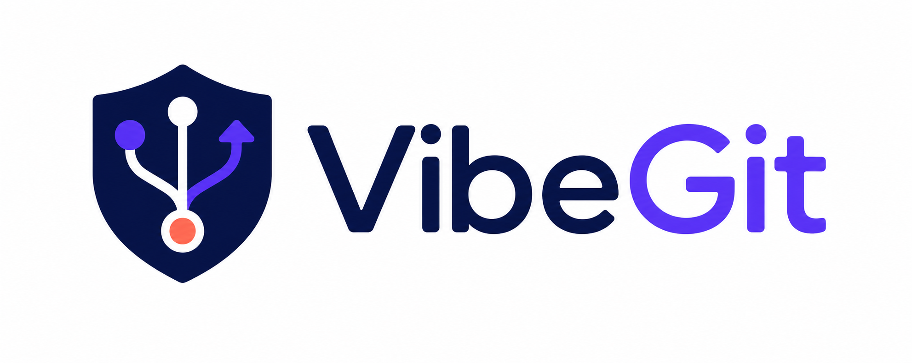

<div dir="rtl">

# VibeGit

<p align="center"></p>

<p align="center"><strong>كل تغيير يجريه الذكاء الاصطناعي محفوظ وقابل للرجوع.</strong><br />شبكة أمان محلية للإصدارات لمستخدمي Codex وClaude Code وكل Vibe Coder.</p>

<p align="center"><a href="#البدء">البدء</a> · <a href="#ما-الذي-يقدمه">القدرات الأساسية</a> · <a href="#الأمان-أولا">الأمان</a> · <a href="#حالة-الإصدار">حالة الإصدار</a></p>

**اللغات / Languages:** [简体中文](README.md) · [繁體中文](README.zh-TW.md) · [English](README.en.md) · [日本語](README.ja.md) · [한국어](README.ko.md) · [Русский](README.ru.md) · [العربية](README.ar.md)

---

يمكن للذكاء الاصطناعي تغيير عشرات الملفات خلال دقائق. السؤال الأهم ليس هل يستطيع التغيير، بل: **ما الذي تغير، وهل يمكن الرجوع بأمان عند عدم الرضا؟**

يضع VibeGit إمكانات Git خلف إجراءات مفهومة: إضافة مشروع، حفظ إصدار، مراجعة التغييرات، وضع العمل جانباً، الرجوع إلى إصدار أقدم، والنسخ الاحتياطي إلى GitHub. لا تحتاج إلى تعلم commit أو branch أو reset قبل أن تدع AI يدفع مشروعك للأمام.

## ما الذي يقدمه

| ما تحتاجه | ما يفعله VibeGit |
| --- | --- |
| التحقق من تغيير AI | يسجل نقاط الحفظ في خط زمني ويعرض قائمة الملفات وإحصاءات التغيير وDiff سطراً بسطر. |
| الرجوع من إصدار غير مناسب | ينشئ نقطة أمان أولاً ويعرض أثر العملية، ويمكن التراجع عن الاستعادة بعدها. |
| تأجيل عمل غير مكتمل | يحفظ التغييرات الحالية مؤقتاً بأمان ويستعيدها بدقة عند الحاجة. |
| الاستخدام دون معرفة Git | يستخدم كلمات يومية مثل مشروع ونقطة حفظ والعودة إلى هذا الإصدار. |
| النسخ الاحتياطي إلى GitHub | ينشئ نسخة Private من دون تغيير `origin` الموجود لديك. |
| تسجيل عمل Agent | يستطيع Agent Events CLI الموحّد إنشاء نقاط حماية قبل المهام وبعدها؛ وقوالب Hook مضمّنة. |

## صُمم لـ Vibe Coding

- **مفهوم:** نقاط حفظ ووصف مهام وDiff قابلة للقراءة بدلاً من تذكر تجزئات commits.
- **قابل للرجوع:** معاينة الأثر ونسخة أمان تلقائية ومسار تراجع.
- **غير مزعج:** الحفظ والاستعادة محليان ولا يعتمدان على الشبكة أو GitHub أو تثبيت Agent.
- **دفاعي:** يحمي كل مشروع بشكل مستقل ويفحص المعلومات الحساسة قبل النسخ البعيد ولا يحذف ملفاتك المحلية.

## البدء

### التشغيل من المصدر

ثبّت Node.js 24+ وpnpm 9+ وGit 2.23+، ثم شغّل الأوامر من جذر المستودع:

```powershell
pnpm install
pnpm dev
```

عند التشغيل الأول اختر مجلد المشروع ثم اختر **تمكين حماية الإصدارات**. يهيئ VibeGit Git عند الحاجة فقط وينشئ نقطة حفظ أولية، ولا ينشئ أو يبدل الفروع العادية في مشاريع Git الموجودة. في Windows يمكنك أيضاً النقر المزدوج على [`启动 VibeGit.bat`](启动%20VibeGit.bat).

### بناء مثبّت Windows

```powershell
pnpm install
pnpm dist:win
```

يُنشأ المثبّت في `release/`. ارفع `VibeGit-Setup-<version>-x64.exe` إلى GitHub Release للمختبرين. ينشئ التثبيت اختصارات سطح المكتب وقائمة «ابدأ»، ولا تحذف إزالة التثبيت بيانات VibeGit الخاصة بالمستخدم.

## الأمان أولا

مبدأ VibeGit هو: **احمِ أولاً، ثم نفّذ العملية.**

- تكتب نقاط الحفظ في `refs/vibegit/checkpoints/*` مع index مؤقت معزول، ولا تغير الفرع أو `HEAD` أو منطقة staging الفعلية.
- لا ينفذ `reset --hard` أو `clean -fd` أو force push، ولا يغير إعدادات Git العامة أو يحذف `.git`.
- قبل الاستعادة ينشئ نقطة أمان قابلة للتحقق؛ وتنقل الملفات المتعارضة غير المتعقبة أو المتجاهلة إلى منطقة استرداد Git خاصة بدلاً من حذفها.
- قبل النسخ إلى GitHub يفحص المفاتيح وبيانات الاعتماد وقواعد البيانات ومجلدات التبعيات/البناء ومؤشرات LFS والملفات الكبيرة. الخطر يوقف الرفع ويحافظ على الملفات محلياً.
- لا يملك Desktop Renderer صلاحية Node.js أو نظام الملفات.

راجع [تصميم الأمان](docs/SECURITY.md) و[البنية](docs/ARCHITECTURE.md).

## نسخ GitHub الاحتياطي الخاص

بعد تثبيت [GitHub CLI](https://cli.github.com/)، افتح **GitHub Backup** في المشروع واختر الاتصال بـ GitHub وإنشاء مفتاح SSH. يكمل VibeGit التفويض في المتصفح، وينشئ مفتاح Ed25519 مخصصاً في بيانات التطبيق ولا يسجل في GitHub إلا المفتاح العام. تستخدم النسخ remote مخصصاً باسم `vibegit` ولا تستبدل `origin` الموجود. التفاصيل في [إعداد GitHub](docs/GITHUB_SETUP.md).

## حالة الإصدار

**v0.1.0 · مصدر MVP قابل للتشغيل**

تم تنفيذ والتحقق من حماية الإصدارات المحلية ونقاط الحفظ والخط الزمني وDiff والاستعادة مع المعاينة والتراجع والحفظ المؤقت ونسخ GitHub الخاص وواجهة Electron وAgent Events CLI الموحّد. مثبّتات Codex وClaude Code التلقائية هي الخطوة التالية؛ توجد قوالب Hook وحدود التحقق موثقة. راجع [سجل التحقق النهائي](docs/FINAL_VALIDATION.md).

## التطوير والمساهمة

```powershell
pnpm lint
pnpm typecheck
pnpm test
pnpm build
pnpm test:cli-build
pnpm test:cli-e2e
pnpm test:desktop
```

- [مواصفات المنتج](docs/PRODUCT_SPEC.md) · [البنية](docs/ARCHITECTURE.md) · [تصميم الأمان](docs/SECURITY.md)
- [معايير القبول](docs/ACCEPTANCE_CRITERIA.md) · [تكامل Codex](docs/CODEX_INTEGRATION.md) · [تكامل Claude Code](docs/CLAUDE_CODE_INTEGRATION.md)

---

**سلّم الأفكار الجريئة إلى AI، واترك طريق العودة إلى VibeGit.**

</div>
